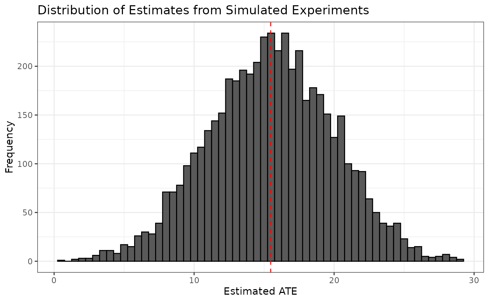

# Confidence Intervals

``` r
library(designrbi)
```

This article demonstrates how to use the package to construct confidence
intervals for an average treatment effect (ATE) estimate using a
simulation-based approach. We will use data from an anchoring experiment
where participants were randomly assigned to either a control or
treatment group, and we will calculate the ATE, simulate experiments
under the null hypothesis, and construct a confidence interval.

The complete pipeline to compute a 95% confidence interval for the ATE
estimate is as follows:

``` r
anchor |>
  experiment_to_schedule(treatment = d, response = y) |>
  impute_unobserved(tau = ate_hat) |>
  sim_experiment(reps = 5000) |>
  group_by(replicate) |>
  summarize(ate_hat = diff_in_means(y, d)) |>
  quantile(probs = c(0.025, 0.975))
```

This article will walk through each step of this pipeline in detail,
starting with understanding the experimental data, then imputing a
schedule of potential outcomes, simulating new experiments, and finally
calculating the confidence interval.

### Understanding the experimental data

Start by loading the necessary libraries and the data.

``` r
library(dplyr)
library(ggplot2)
library(readr)
anchor <- read_csv("https://stat158.berkeley.edu/spring-2026/data/anchoring/anchoring.csv") |>
  mutate(d = factor(X),
         y = Y) |>
  select(d, y)
anchor
#> # A tibble: 74 × 2
#>    d         y
#>    <fct> <dbl>
#>  1 11     16  
#>  2 11      5  
#>  3 73     20  
#>  4 73     40  
#>  5 11     73  
#>  6 73     70  
#>  7 11      6.5
#>  8 73     12  
#>  9 11     15  
#> 10 11     70  
#> # ℹ 64 more rows
```

Note the structure of experimental data: each row corresponds to a
single unit (participant) and contains the treatment assignment () and
the observed response ().

In this experiment, the estimand of interest is the average treatment
effect (ATE), which can be estimated using the difference in means
between the treatment and control groups. We can write such a function
to operate on the response and treatment vectors and use it to calculate
the observed ATE estimate.

``` r
diff_in_means <- function(y, x) {
  groups <- split(y, x)
  Ybarhat0 <- mean(groups[[1]])
  Ybarhat1 <- mean(groups[[2]])
  Ybarhat1 - Ybarhat0
}

ate_hat <- diff_in_means(anchor$y, anchor$d)
ate_hat
#> [1] 15.46992
```

### Impute a schedule of potential outcomes

A RBI confidence interval seeks to quantify the variability that was
induced by the random assignment that occurred at the outset of the
experiment. To do this, we first need to impute the unobserved potential
outcomes for each unit in the experiment. Let’s start by creating a
schedule of the observed potential outcomes.

``` r
schedule <- anchor |>
  experiment_to_schedule(treatment = d, response = y)
schedule
#> # A tibble: 74 × 4
#>    d         y   Y11   Y73
#>    <fct> <dbl> <dbl> <dbl>
#>  1 11     16    16      NA
#>  2 11      5     5      NA
#>  3 73     20    NA      20
#>  4 73     40    NA      40
#>  5 11     73    73      NA
#>  6 73     70    NA      70
#>  7 11      6.5   6.5    NA
#>  8 73     12    NA      12
#>  9 11     15    15      NA
#> 10 11     70    70      NA
#> # ℹ 64 more rows
```

Note that the schedule contains the observed potential outcomes for each
unit, but the unobserved potential outcomes are missing. We can use the
observed ATE estimate to impute the unobserved potential outcomes by
assuming that the treatment effect is constant across all units.

``` r
imputed_schedule <- impute_unobserved(schedule, tau = ate_hat)
imputed_schedule
#> # A tibble: 74 × 4
#>    d         y   Y11   Y73
#>    <fct> <dbl> <dbl> <dbl>
#>  1 11     16   16     31.5
#>  2 11      5    5     20.5
#>  3 73     20    4.53  20  
#>  4 73     40   24.5   40  
#>  5 11     73   73     88.5
#>  6 73     70   54.5   70  
#>  7 11      6.5  6.5   22.0
#>  8 73     12   -3.47  12  
#>  9 11     15   15     30.5
#> 10 11     70   70     85.5
#> # ℹ 64 more rows
```

While this is likely not the true schedule of potential outcomes, it is
a useful tool for simulating the random assignment process and
understanding the variability of our ATE estimate.

### Simulate a single experiment

Now that we have a schedule of potential outcomes, we can simulate the
random assignment process to generate new datasets that could have been
observed under the same experimental design. Let’s start by simulating a
single experiment.

``` r
set.seed(402) # for reproducibility
sim1 <- imputed_schedule |>
  sim_experiment(reps = 1)
sim1
#> # A tibble: 74 × 3
#>    replicate d         y
#>        <int> <fct> <dbl>
#>  1         1 73    31.5 
#>  2         1 11     5   
#>  3         1 73    20   
#>  4         1 11    24.5 
#>  5         1 73    88.5 
#>  6         1 73    70   
#>  7         1 11     6.5 
#>  8         1 11    -3.47
#>  9         1 73    30.5 
#> 10         1 11    70   
#> # ℹ 64 more rows
```

We can compare this to the original data set:

``` r
anchor
#> # A tibble: 74 × 2
#>    d         y
#>    <fct> <dbl>
#>  1 11     16  
#>  2 11      5  
#>  3 73     20  
#>  4 73     40  
#>  5 11     73  
#>  6 73     70  
#>  7 11      6.5
#>  8 73     12  
#>  9 11     15  
#> 10 11     70  
#> # ℹ 64 more rows
```

The units are the same across both data sets, but the treatment
assignments and observed responses may differ due to the random
assignment process. The first unit, for example was assigned to `73`
simulated experiment, so we observed $Y_{1}(1)$: 31.5. In the original
data, the first unit was assigned to `11` and we observed $Y_{1}(0)$:
16. The second unit, was assigned to `11` in both the original
experiment and the simulated experiment, so we observed $Y_{2}(0)$: 5 in
both cases.

We can calculate the ATE estimate for this simulated experiment.

``` r
ate_hat_sim1 <- sim1 |>
  summarize(ate_hat = diff_in_means(y, d))
ate_hat_sim1
#> # A tibble: 1 × 1
#>   ate_hat
#>     <dbl>
#> 1    17.3
```

This serves as a proof of concept that we can simulate new experiments
and calculate new ATE estimates under the same experimental design.
However, a single simulated experiment is not enough to understand the
variability of our ATE estimate. We need to simulate many experiments to
get a distribution of ATE estimates.

### Simulating many experiments

Let’s use the same approach but simulate 5000 experiments.

``` r
sim5000 <- imputed_schedule |>
  sim_experiment(reps = 5000)
head(sim5000)
#> # A tibble: 6 × 3
#>   replicate d         y
#>       <int> <fct> <dbl>
#> 1         1 11    16   
#> 2         1 73    20.5 
#> 3         1 11     4.53
#> 4         1 73    40   
#> 5         1 11    73   
#> 6         1 73    70
tail(sim5000)
#> # A tibble: 6 × 3
#>   replicate d         y
#>       <int> <fct> <dbl>
#> 1      5000 73     60  
#> 2      5000 73     32  
#> 3      5000 11     25  
#> 4      5000 73     60  
#> 5      5000 11     26.7
#> 6      5000 11     28
```

[`sim_experiment()`](https://github.com/andrewpbray/designrbi/reference/sim_experiment.md)
returns the 5000 simulated experiments as a single tall data frame, each
one stacked on top of one another, with a new variable called
`replicate` that indicates which rows belong to which simulated
experiment. We can use this variable to group the data and calculate the
ATE estimate for each simulated experiment.

``` r
sim5000_estimates <- sim5000 |>
  group_by(replicate) |>
  summarize(ate_hat = diff_in_means(y, d))
sim5000_estimates
#> # A tibble: 5,000 × 2
#>    replicate ate_hat
#>        <int>   <dbl>
#>  1         1    13.3
#>  2         2    21.5
#>  3         3    20.9
#>  4         4    19.8
#>  5         5    14.2
#>  6         6    16.7
#>  7         7    13.6
#>  8         8    13.9
#>  9         9    19.3
#> 10        10    16.9
#> # ℹ 4,990 more rows
```

We can visualize the distribution of ATE estimates from the simulated
experiments and see that it is centered around the observed ATE estimate
from the original experiment.

``` r
ggplot(sim5000_estimates, aes(x = ate_hat)) +
  geom_histogram(binwidth = 0.5, color = "black") +
  geom_vline(xintercept = ate_hat, color = "red", linetype = "dashed") +
  labs(title = "Distribution of Estimates from Simulated Experiments",
       x = "Estimated ATE",
       y = "Frequency") +
  theme_bw()
```



### Calculate confidence interval

A $1 - \alpha$ confidence interval summarizes the distribution of ATE
estimates from the simulated experiments with two numbers, the lower and
upper bounds, taken from the quantiles of the distribution.

``` r
alpha <- 0.05 # for a 95% confidence interval
ci <- quantile(sim5000_estimates$ate_hat, probs = c(alpha/2, 1 - alpha/2))
ci
#>      2.5%     97.5% 
#>  6.631069 24.118810
```
